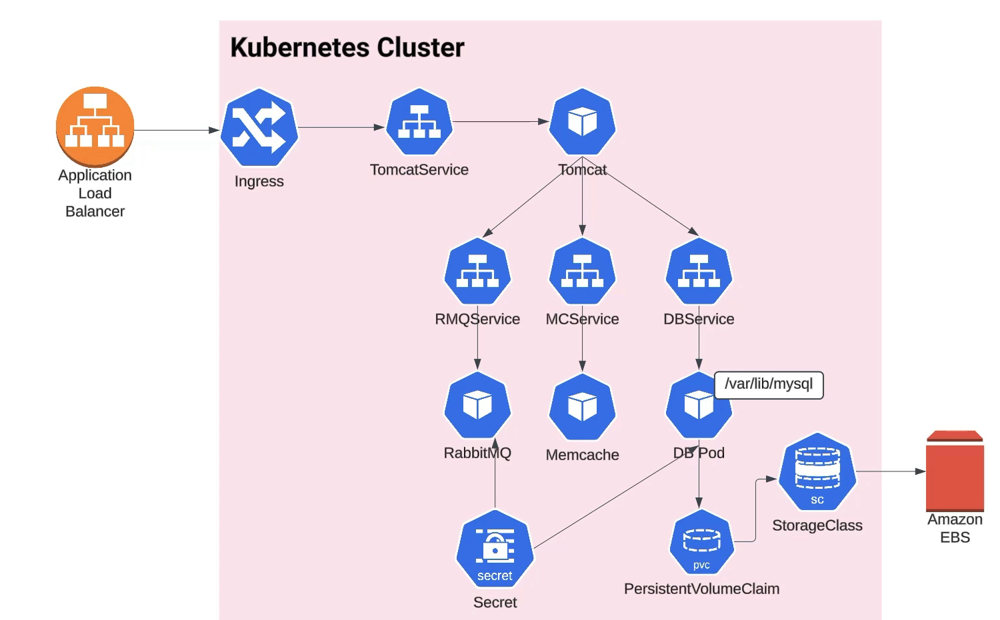

# Kubernetes VProfile Application



## Overview

This project demonstrates the deployment of the **VProfile application** on a **production-grade Kubernetes cluster** running on AWS, provisioned using **kOps**.

Cluster management is performed from a dedicated EC2 instance configured as the administration node. This instance should have the following tools installed:

kops → for cluster creation and management

kubectl → for interacting with the Kubernetes API

aws-cli → for AWS resource management

Optionally, helm → for managing Helm charts if needed

We started from an existing project with all necessary configurations defined for inter-service communication and Docker images already available in a registry.

Although this is a simple project, it allows working in a real production environment and understanding how to use different Kubernetes objects to run an application.

## Repository Structure

```
|-- architecture
|   `-- cluster.png
|-- kubedefs
|   |-- appdeploy.yaml
|   |-- appservice.yaml
|   |-- dbdeploy.yaml
|   |-- dbpvc.yaml
|   |-- dbservice.yaml
|   |-- ingress.yaml
|   |-- mcdeploy.yaml
|   |-- mcservice.yaml
|   |-- rmqdeploy.yaml
|   |-- rmqservice.yaml
|   `-- secret.yaml
|-- screenshots
`-- vprofile-app
    |-- main
    `-- test
```

## Kubernetes Manifests

* **appdeploy.yaml** → Deployment of the main application.
* **appservice.yaml** → Service exposing the application internally.
* **dbdeploy.yaml** → Database deployment.
* **dbpvc.yaml** → PersistentVolumeClaim for database storage.
* **dbservice.yaml** → Service for the database.
* **mcdeploy.yaml** → Deployment of Memcached.
* **mcservice.yaml** → Service for Memcached.
* **rmqdeploy.yaml** → Deployment of RabbitMQ.
* **rmqservice.yaml** → Service for RabbitMQ.
* **secret.yaml** → Kubernetes Secrets for sensitive data.
* **ingress.yaml** → Ingress to expose the application externally.

## Ingress Controller

The **Ingress Controller** was installed directly with:

```bash
kubectl apply -f https://raw.githubusercontent.com/kubernetes/ingress-nginx/controller-v1.1.3/deploy/static/provider/aws/deploy.yaml
```

When deployed on AWS, this controller automatically creates a Network Load Balancer (NLB) to route external traffic to the cluster. NLBs offer high performance and TCP-level routing, making them suitable for production workloads. 

Ingress allows exposing the application using a registered domain (`rcginfo.xyz`) from GoDaddy.


## Notes

* Secrets ensure credentials are secure.
* PVC guarantees data persistence for the database (default is AWS EBS).
* Services allow communication between pods.
* Ingress enables external access to the application.
* The project demonstrates a simple but production-ready AWS Kubernetes deployment.
* Educational insights: understanding Deployments, Services, PVCs, Secrets, and Ingress in a real cluster.

## Screenshots

* 
* 
* 
* 
* 
